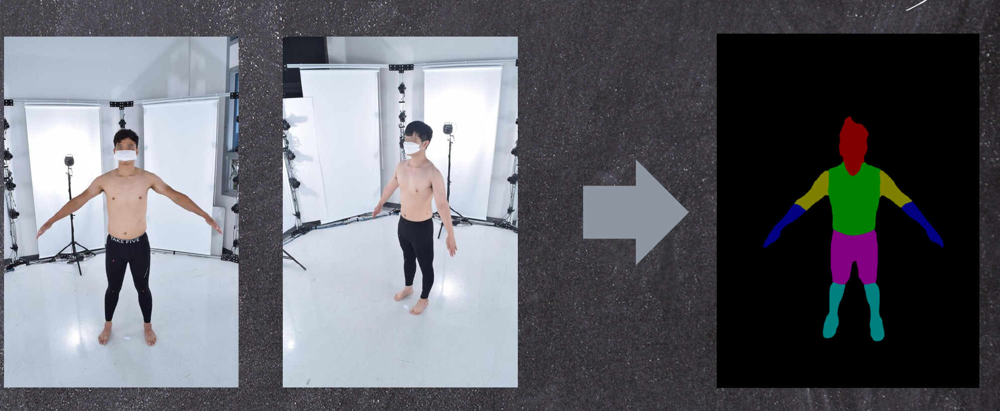
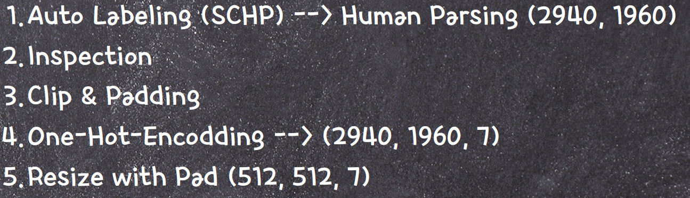

# 4차 프로젝트

## Human Segmentation을 활용한 체형 변화 추적 서비스

## 기획 의도
- 보통 사람들은 매번 Inbody를 찍을 수 없어서 사진을 찍어서 기록을 하며 눈바디를 진행한다.
- 그래서 사진을 찍음으로써 AI가 대략적인 측정을 해주면서 결과를 제시해주는 AI를 개발하는게 목표.
- 이미 출시된 서비스에서는 다양한 방향으로 사진을 찍어 3D분석을 해주는게 있지만 우리는 여러번의 번거러움을 피해 사진 하나로만 진행하려한다.

## 데이터 수집
- AI Hub에서 신체 데이터 수집 -> 데이터가 프로젝트의 목적에 적합하지 않음
- 그래서 ROBOFLOW를 사용하여 직접 세그멘 테이션을 진행 -> 많은 양의 원천 데이터를 모두 활용하기에 부적합
- 사전 훈련된 SCHP 모델을 활용하여 세그멘테이션을 진행

## 데이터 전처리

## 모델 구조
- 이미지에서 배경을 제거 -> 부위별 분할 모델 -> 세그멘테이션

## 사용한 모델
- UNET
